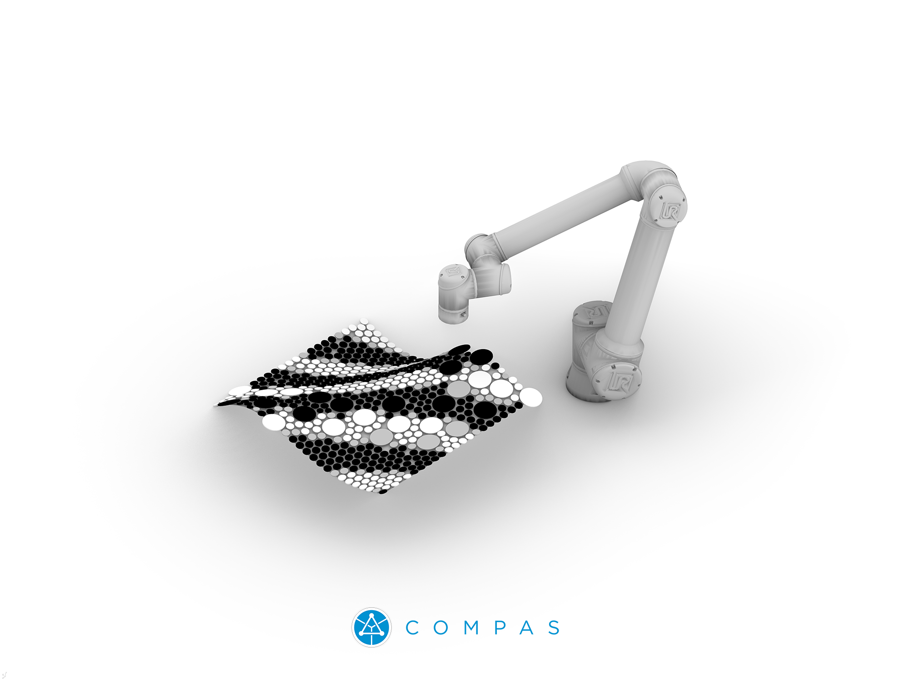

# Designing Robotic Pixels with COMPAS 

> Materials for the "Designing Robotic Pixels with COMPAS" workshop, MRAC Workshop 2.2, 2024.

_Image by [Gramazio Kohler Research, ETH Zürich](https://gramaziokohler.arch.ethz.ch/)_

* Faculty: Gonzalo Casas & Kunaljit Chadha
* Faculty Assistant: Huanyu Li
* Links:
  * 🎦 [Slides](https://docs.google.com/presentation/d/1m59cEtPp25IMWxES_kuCp0B__-3EWvAtB_3N5xkJXog/edit#slide=id.g2bbe6105f44_0_793)
  * 💠 [COMPAS core documentation](https://compas.dev/compas/1.17.9/)
  * 🤖 [COMPAS FAB documentation](https://compas.dev/compas_fab/0.28.0/)

## Getting started

See [here](getting-started/README.md) for details about software requirements and installation of the tools.

## Description 

The art and craft of tiling mosaics is deeply connected to the city of Barcelona and its history. Mosaics, with their intricate designs and vibrant colours, can be seen adorning many historical buildings and public spaces in the city. Like many other traditional crafts, it heavily relies on highly skilled artisanry to produce aesthetically pleasing results. However, the advent of modern digital fabrication techniques offers a transformative potential to this age-old craft.

In this workshop, we explore the possibilities that the merger of traditional craft and modern digital fabrication techniques bring to the designer’s table. We begin with an exploration phase, iterating and discovering different tiling design options for the target surface. These designs are articulated using the geometry kernel of the COMPAS framework for parametric geometry generation. The journey progresses to materialising these designs using a collaborative robotic setup, offering hands-on experience in robotic planning, control, and sensing applied to the art of tiling.

The work will be carried out using a workflow fully integrated into the Rhino/Grasshopper design environment.

Participants will not only gain practical skills but also an appreciation for the importance of open-source tools in ensuring the digital sustainability of the design and fabrication processes. This approach democratises access to advanced techniques and fosters a community of shared knowledge and resources.

## Learning Objectives 

The workshop will present an integrated software and hardware workflow for robotic tiling. At the end of the workshop, participants should be able to:

* Explore new parametric tiling designs
* Understand the possibilities and limits of robotic tiling setups
* Understand principles of robotic path planning and kinematics
* Understand the basics of the COMPAS framework and its robotic planning extensions
* Understand how to incorporate sensor information into the process
* Be able to program collaborative robotics using simple online control interfaces

## License and usage rights

The materials of this workshop are licensed under the [MIT License](LICENSE). If you use it in your own research, please cite/credit the authors of the different components (COMPAS, COMPAS FAB, COMPAS EVE, COMPAS URT design tool, etc).
